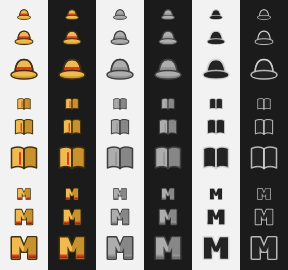

# Artwork contribution guide

Bundled artwork is part of mangame's interface, not decoration. At tray size,
shape and contrast are the only language available, so an accidental palette
or silhouette change is a behaviour change.

## The visual contract



The rows are `onepiece`, `book`, then `mangame`. The columns are ready, due,
then break. Each cell shows 16, 22 and 32 pixels from top to bottom, duplicated
on a light and a dark panel.

The contact sheet pins the important comparison sizes. `icon-pixels.json`
additionally hashes the decoded pixels of every shipped PNG size, not the PNG
file bytes. Re-encoding an unchanged image is harmless; changing what a user
sees requires an intentional manifest and reference update that appears in the
pull request.

```bash
uv run python tools/gen_icons.py --check
```

That command also checks that every SVG still matches the Python generator,
every required PNG exists at its stated dimensions, and every ICO is present.
It needs Pillow but not Inkscape or ImageMagick, so it runs in the normal test
environment.

## Changing bundled artwork

1. Edit the shape or palette in `tools/gen_icons.py`.
2. Regenerate only the emblem you changed:

   ```bash
   uv run python tools/gen_icons.py mangame
   ```

3. Inspect `docs/icon-reference.png` at its native size and enlarged. Check all
   three states on both panel tones.
4. Run the full quality gate from `CONTRIBUTING.md`.
5. Include the updated reference image in the pull request description.

The current reference was rendered with Inkscape 1.2.2 and ImageMagick
6.9.12-98. Other versions may anti-alias edges differently; the committed
reference remains the authority, so renderer churn cannot silently change the
shipped pixels.

To approve an intentional pixel-only change after reviewing the generated
assets:

```bash
uv run python tools/gen_icons.py --update-reference
```

## What can be contributed

- Original work that the contributor has the right to license with the
  project.
- Generic objects, letters or abstract marks that remain recognisable at
  16 pixels.
- All three states: full colour for ready, mid-grey for due, and a silhouette
  with an opposing rim for break.

Do not contribute copied character art, publisher marks, series logos or
traced third-party artwork. A visual reference or theme may inspire a generic
object; it may not be reproduced.

User-imported artwork is intentionally outside this contract. It lives in the
user data directory and is never committed to the repository.
